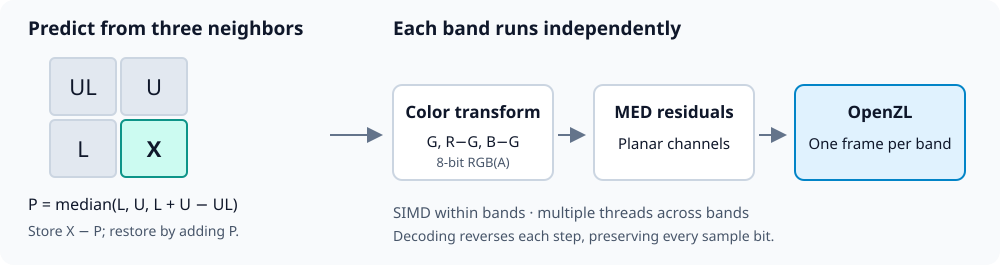
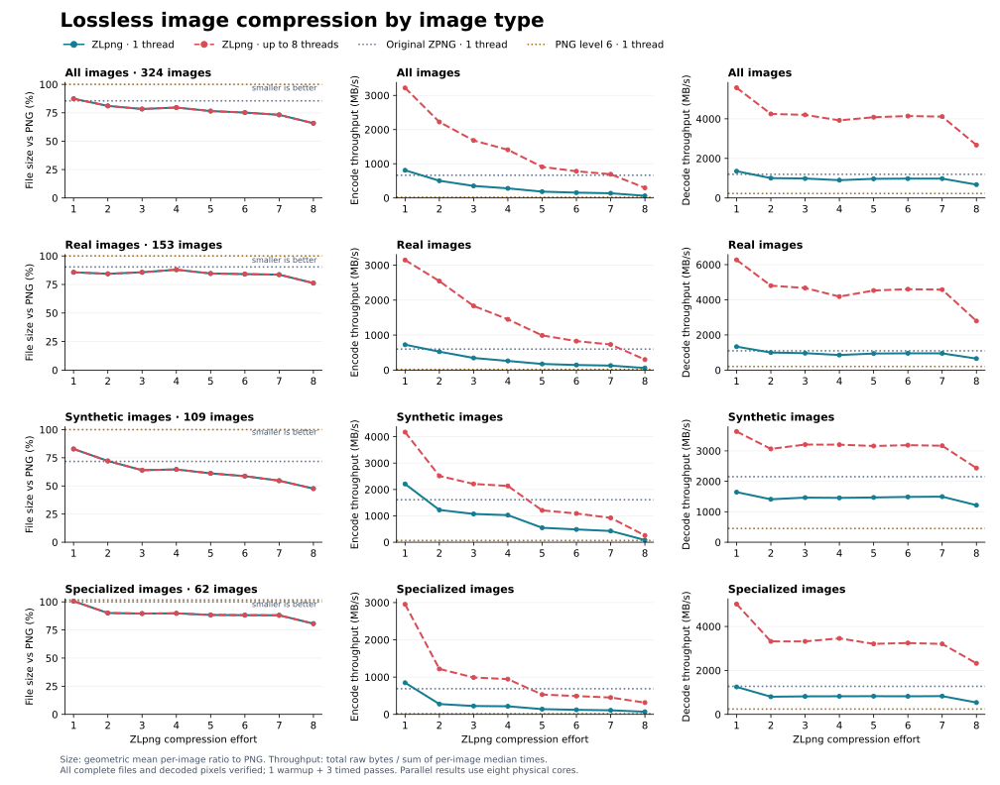

# ZLpng

A simple lossless image codec: **median edge prediction + [OpenZL](https://openzl.org/)**.
Supports 1–4 channels, 8/16-bit samples, alpha, and exact hidden RGB values.
SIMD speeds up prediction; independent horizontal bands allow parallel
compression and decompression. Every compression effort uses the same filter.

## How it works



For a sample $X$, let $L$, $U$, and $UL$ be its left, upper, and upper-left
neighbors. The predictor follows local edges without overshooting:

$$P = \mathrm{median}(L,\ U,\ L+U-UL)$$

$$r = (X-P) \bmod 2^b \qquad X = (r+P) \bmod 2^b$$

Here $b$ is 8 or 16. The decoder has the same neighbors, so adding the
prediction restores the sample exactly. Missing neighbors are zero.

For 8-bit RGB(A), first store $(G,R-G,B-G[,A])$ with modular subtraction.
Other formats keep their channels unchanged. MED residuals are arranged
in channel planes and compressed with OpenZL. Each roughly 256 KiB band
resets the predictor, allowing both directions to use up to eight workers.
The x86 implementation uses SIMD with a portable scalar fallback.

## Benchmarks by image type

**324 images, 852.58 MiB of raw samples:** 153 real (photos, graphics, text),
109 synthetic, and 62 scientific/specialized. On one thread, effort 1 encodes
at **810 MB/s** and decodes at **1352 MB/s**, versus
665/1194 MB/s for original ZPNG. With up to eight threads, it reaches
**3.22/5.57 GB/s**.



Compression ratio = total raw bytes / total stored bytes; higher is better.

| Image type | PNG | Original ZPNG | ZLpng effort 1 | ZLpng effort 8 |
| --- | ---: | ---: | ---: | ---: |
| Real | 2.024× | 1.988× | 2.131× | 2.257× |
| Synthetic | 5.725× | 6.016× | 5.944× | 7.436× |
| Specialized | 1.674× | 1.657× | 1.672× | 2.022× |
| All | 2.141× | 2.113× | 2.232× | 2.436× |

Mean size savings below use the geometric mean of per-image file-size ratios
to PNG. Times are mean milliseconds per image, shown as **1 thread / 8 threads**.
Serial baselines use one thread. Some images favor PNG or ZPNG.

| Codec / effort | Raw/stored | Mean saving vs PNG | Encode ms | Decode ms |
| --- | ---: | ---: | ---: | ---: |
| PNG | 2.141× | 0.00% | 131.856 / — | 12.261 / — |
| Original ZPNG | 2.113× | 14.48% | 4.152 / — | 2.312 / — |
| 1 | 2.232× | 12.66% | 3.408 / 0.857 | 2.041 / 0.495 |
| 2 | 2.351× | 18.96% | 5.487 / 1.242 | 2.752 / 0.650 |
| 3 | 2.318× | 21.68% | 7.852 / 1.641 | 2.809 / 0.657 |
| 4 | 2.247× | 20.39% | 9.835 / 1.958 | 3.068 / 0.704 |
| 5 | 2.332× | 23.51% | 14.915 / 3.038 | 2.853 / 0.676 |
| 6 | 2.337× | 24.82% | 17.762 / 3.533 | 2.822 / 0.667 |
| 7 | 2.341× | 26.82% | 20.078 / 3.981 | 2.822 / 0.671 |
| 8 | 2.436× | 34.25% | 44.036 / 9.333 | 4.094 / 1.033 |

AMD Threadripper PRO 9985WX, GCC 13.3, native release build. Each image uses
one warmup and the median of three shuffled, verified API timings; filtering,
allocation, framing and thread startup are included, file I/O is excluded.
PNG uses libpng 1.6.43/zlib 1.3, level 6 with adaptive filters and unchanged
sample depth/channels. MB/s and GB/s use decimal bytes. This corpus was used
during tuning.

[Measurements and reproduction](benchmarks/README.md) ·
[Detailed image-type results](benchmarks/summary.csv)

## Build and use

Requires CMake 3.20.2+, C11/C++17, and a 64-bit platform. CMake fetches pinned
OpenZL 0.3.0 and its dependencies.

```sh
cmake -S . -B build -DCMAKE_BUILD_TYPE=Release -DZLPNG_NATIVE=ON
cmake --build build -j
ctest --test-dir build --output-on-failure

build/zlpng compress input.zraw output.zlp --effort 1 --threads 8
build/zlpng decompress output.zlp restored.zraw --threads 8
```

Effort 1 uses fast native LZ; efforts 2–8 use OpenZL numeric levels 1–7.
Higher effort does not guarantee smaller files: level 4 regresses here.
Use 1 for speed, 2 for a balanced setting, and 8 for the smallest corpus total.
Threads default to automatic (up to eight); use `--threads 1` for serial
operation. Omit `ZLPNG_NATIVE` when building portable binaries.

Link `ZLpng::ZLpng` and include [`zlpng.h`](zlpng.h) for the C API.
The CLI's `.zraw` format preserves sample depth and channel count; see the
[format/API guide](docs/FORMAT.md). ZLpng's `ZLP2` files are incompatible
with original ZPNG and earlier experimental ZLpng files.

## Credits

Christopher A. Taylor — mrcatid@gmail.com. BSD-3-Clause.
MED is the predictor used by [JPEG-LS / LOCO-I](https://doi.org/10.1109/83.855427).
OpenZL is developed by Meta and its contributors.
